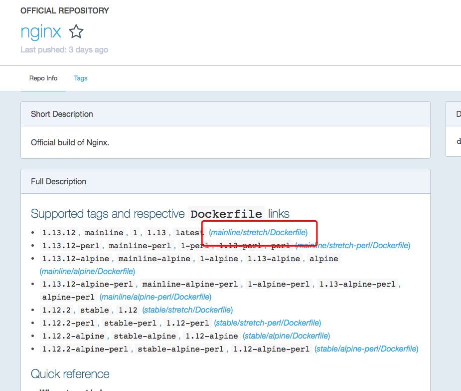

# Dockerfile构建镜像
#w-blog博客/kube


几乎所有的image都是通过Dockerfile生成出来的,使用Dockerfile可以让我们很轻松的构建出一个镜像,我们如果需要部署自己的程序常常也可会Dockerfile把代码和环境构建成一个image进行使用

附上:

喵了个咪的博客:[w-blog.cn](w-blog.cn)

官方Git地址:[https://github.com/moby/moby](https://github.com/moby/moby)

## 1.DockerFile介绍

以hub.docker中的项目来说,一般作者都会存放这个image对应的Dockerfile,我们也可以直接使用Dockerfile来生成自己的nginx镜像




## 2.编译自己的nginx

Dockerfile可以基于任何镜像的技术上搭建环境,可以基于别人做好的镜像比如Nginx,也可以基于基础镜像比如centos等,这里基于nginx镜像构建出本地的nginx:local并且运行镜像不在启动nginx只是输出一条nginx

```
> vim Dockerfile
FROM nginx:1.13.12
CMD ["echo", "nginx"]

> docker build -t nginx:local .
> docker images
REPOSITORY                                                          TAG                 IMAGE ID            CREATED             SIZE
nginx                                                               local               6ea964efbbc8        10 seconds ago      109 MB

> docker run -it nginx:local
> docker run -it nginx:local
nginx
```


## 3.Dockerfile 语法

使用以下的语法可以实现各种各样的镜像

- FROM：指定父镜像，可以通过添加多个FROM，在同一个Dockerfile中创建多个镜像
- MAINTAINER：维护者信息，可选
- RUN：用来修改镜像的命令，可以用来安装程序，当一条RUN完成后，会在当前的镜像上创建一个新的镜像层，接下来的指令会在新的镜像层上执行。有2种形式。 
	- RUN [“apt-get”, “update”]，调用exec
	- RUN apt-get update,调用的/bin/sh
- EXPOSE：用来指明容器内进程对外开放的端口。在docker run的时候可以加-p（可以将EXPOSE中没列出的端口设置为对外开放）和-P（EXPOSE里所指定的端口映射到主机上另外的随机端口？？？）来设置端口。
- ADD：向新容器中添加文件,文件可以是 
	- 主机文件：必须是相对Dockerfile所在目录的相对路径（如果是压缩文件，docker会解压缩）
	- 网络文件：URL文件，在创建容器时会下载下来添加到镜像中。（如果是压缩文件，docker不会解压缩）
	- 目录：必须是相对Dockerfile所在目录的相对路径（如果是压缩文件，docker会解压缩）
- COPY: 与ADD的区别是COPY的<src>只能是本地文件，其他用法一致
- VOLUME：会在镜像里创建一个指定路径的挂载点。这个路径可以来自主机，也可以来自其他容器，多个容器通过同一个挂载点来共享数据，即便有个容器已经停止，其余容器还是可以访问挂载点，只有当挂载点所有的容器引用消失，挂载点才会自动删除。
- WORKDIR：为接下来的指令指定一个新的工作目录。当启动一个容器后，最后一条WORKDIR指令所指向的目录为容器当前运行的工作目录。
- ENV：设置环境变量，在docker run 时可以用-e来设置环境变量docker run -e WEBAPP_PORT=8000 -e WEBAPP_HOST=www.example.com
- CMD：设置容器运行时默认运行的命令，CMD参数格式与RUN类似。CMD ls -l -a 或CMD ["ls", "-l", "-a"]
- ENTRYPOIN：与CMD类似，指定容器运行时默认命令。ENTRYPOINT和CMD的区别，在于运行容器时，镜像后的命令参数，ENTRYPOINT是拼接，CMD是覆盖
- USER：为容器的运行和RUN CMD ENTRYPOINT等指令的运行 指定用户或者UID
- ONBUILD：触发器指令，父镜像中不会执行，只有在子镜像中才会执行。 
给一个例子


