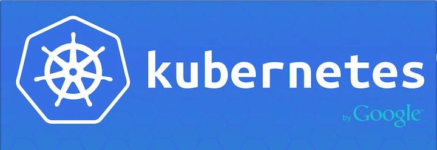

# Docker应用容器引擎介绍与搭建



Docker相信大家都不默认,没有实践过的童鞋也应该听过他的大名,笔者最近挺长一段使用都在使用Docker解决各种问题,而在最近也吧Kubernetes的坑爬完实践了起来,那么从今天开始笔者会带来关于Docker容器化相关的博文,一同探索Docker为什么这么火热,我们怎么去实践使用它.

附上:

喵了个咪的博客:[w-blog.cn](w-blog.cn)
官方Git地址:[https://github.com/moby/moby](https://github.com/moby/moby)

## 1. 为什么Docker会火
- 截止到现在Docker在github上的star数有48570
- 阿里云,腾讯云,AWS,都推出了自己的Docker平台
- 70%的调查企业已经正在使用或考虑使用Docker;

大家回顾以往的经理往往比较火的软件系统(比如Hadoop)都是解决了一个领域上痛点,Docker也不例外,就笔者总结有如下痛点是Docker解决的:

- 复杂的环境搭建
笔者之前安装一个软件可能有各种依赖关系极为复杂(比如:APPRTC),Docker可以吧环境依赖打包在一起只需要一条命令就可以开箱使用
- 隔离性 - 每个用户实例之间相互隔离, 互不影响。
比如你的程序A需要使用PHP7.0,程序B需要使用PHP7.2,但是程序A不能使用PHP7.2,在虚拟的时候你只能选择开两台,使用docker就可以在同一台服务器互不影响的情况下顺利运行
- 可配额/可度量 - 每个用户实例可以按需提供其计算资源，所使用的资源可以被计量。
笔者在运营环境出过一次事故,大致是A应用除了点问题导致CPU吃高,其他程序全部都无法访问,有的docker可以定额分配资源限制不重要的程序不会影响到重要的程序
- 移动性 - 用户的实例可以很方便地复制、移动和重建以及回滚。
- 基本不增加额外的性能消耗
Docker直接移植于Linux内核之上，通过运行Linux进程将底层设备虚拟隔离，这样系统性能的损耗也要比虚拟机低的多，几乎可以忽略。同时，Docker应用容器的启停非常高效，可以支持大规模的分布系统的水平扩展，真正给企业开发带来福音。
- DevOps持续迭代交付
Docker技术将应用以集装箱的方式打包交付，使应用在不同的团队中共享，通过镜像的方式应用可以部署于任何环境中。这样避免了各团队之间的协作问题的出现，成为企业实现DevOps目标的重要工具。以容器方式交付的Docker技术支持不断地开发迭代，大大提升了产品开发和交付速度。

正如中国惠普云计算集成云技术首席专家刘艳凯所说的那样：“任何一项技术的发展和它受到的追捧，都是因为它能够解决困扰人们的问题”,Docker就是用来解决这个问题的

## 2. 搭建安装

* [Mac安装](https://docs.docker.com/docker-for-mac/install/)
* [ubuntu安装](https://docs.docker.com/install/linux/docker-ce/ubuntu/)
* [Windows安装](https://docs.docker.com/docker-for-windows/install/)
* [centos安装](https://docs.docker.com/install/linux/docker-ce/centos/)

这里选择使用Centos来安装Docker

1. 安装所需的包。yum-utils提供了yum-config-manager 效用，并device-mapper-persistent-data和lvm2由需要 devicemapper存储驱动程序。

```bash
> yum install -y yum-utils device-mapper-persistent-data lvm2
```

2. 使用以下命令设置release存储库。即使您想从edge和test存储库安装构建，也总是需要release存储库。

```bash
> yum-config-manager --add-repo https://download.docker.com/linux/centos/docker-ce.repo
```

3. 可选：启用edge和test存储库。这些存储库包含在docker.repo上面的文件中，但默认情况下处于禁用状态。您可以将它们与稳定的存储库一起启用

```bash
> yum-config-manager --enable docker-ce-edge
```

```bash
> yum-config-manager --enable docker-ce-test
```

您可以通过使用该标志运行命令来禁用edge和test存储库 。
```bash
> yum-config-manager --disable docker-ce-edge
```

### 安装Docker CE

通过以下命令可以直接安装最新版本的Docker-ce

```bash
> yum install docker-ce
```

> 如果启用了多个Yum存储库，则安装或更新时未指定版本yum install或 yum update命令始终会安装尽可能高的版本，这可能不适合您的稳定性需求。  

在生产系统上，您应该安装特定版本的Docker CE，而不是始终使用最新版本。列出可用的版本。

此示例使用该sort -r命令按版本号对结果进行排序，从最高到最低。
```bash
> yum list docker-ce --showduplicates | sort -r

docker-ce.x86_64            18.02.0.ce-1.el7.centos             docker-ce-edge  
docker-ce.x86_64            18.01.0.ce-1.el7.centos             docker-ce-edge  
docker-ce.x86_64            17.12.1.ce-1.el7.centos             docker-ce-stable
docker-ce.x86_64            17.12.1.ce-1.el7.centos             docker-ce-edge  
docker-ce.x86_64            17.12.0.ce-1.el7.centos             docker-ce-stable
docker-ce.x86_64            17.12.0.ce-1.el7.centos             docker-ce-edge  
docker-ce.x86_64            17.11.0.ce-1.el7.centos             docker-ce-edge  
docker-ce.x86_64            17.10.0.ce-1.el7.centos             docker-ce-edge  
```

列表的内容取决于启用了哪些存储库，并且特定于您的CentOS .el7版本（在此示例中，由版本的后缀指示）。选择一个特定的版本进行安装。第二列是版本字符串。您可以使用整个版本字符串。第三列是存储库名称，它指示软件包来自哪个存储库。要安装特定版本，请将版本字符串附加到包名称并用连字符（-）分隔。

> 注意：版本字符串是软件包名称加上第一个连字符的版本。在上面的例子中，完全的包名是docker-ce-17.03.0.ce  

为了后面可是搭建Kubernetes可以参考个更新日志里面的描述[kubernetes/CHANGELOG-1.8.md at master · kubernetes/kubernetes · GitHub](https://github.com/kubernetes/kubernetes/blob/master/CHANGELOG-1.8.md#v1810)

```
Kubernetes 1.8  <--Docker 1.11.2 to 1.13.1 and 17.03.2
```

这里选择Rancher认证过的17.03.2并且K8S支持版本

```bash
# 先安装docker-ce-selinux-17.03.2.ce，否则安装docker-ce会报错
> yum install https://download.docker.com/linux/centos/7/x86_64/stable/Packages/docker-ce-selinux-17.03.2.ce-1.el7.centos.noarch.rpm 
> yum install docker-ce-17.03.2.ce
```

启动Docker并且设置开机自启。

```bash
> systemctl start docker
> systemctl enable docker
```

docker通过运行hello-world 映像验证安装是否正确。

```bash
> docker run hello-world
# 如下输出证明已经完成了Docker环境的搭建
Hello from Docker!
```

第一步已经完成已经可以使用Docker环境了,下一步我们需要熟悉Docker相关的一些命令


