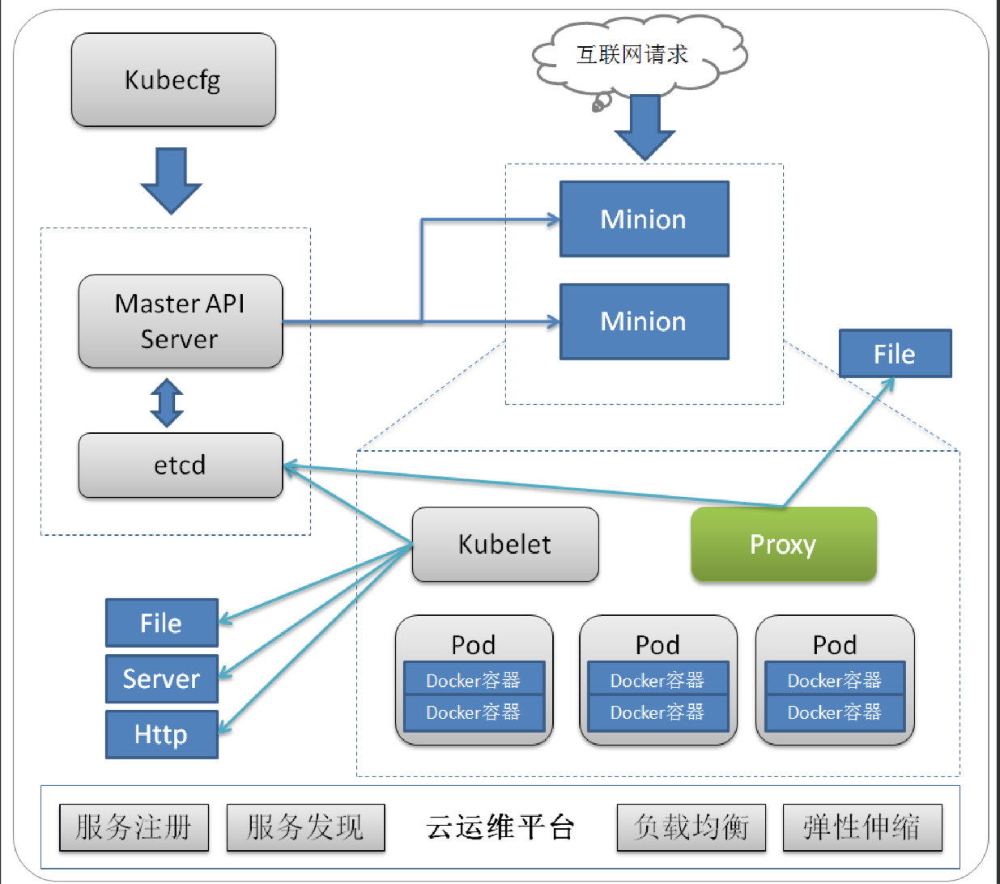

# Docker编排工具Docker-compose
#w-blog博客/kube




当然我们已经了解了Docker基础使用,当然我们要全面Docker化还有一段路要走,今天给大家带来的是编排工具,应为复杂度使用docker run 容器的时候需要配置很多内容比如端口映射,磁盘挂载,环境变量等,全部在命令中格式麻烦也不好保存,并且如果多个容器之前需要关联也特别麻烦,所以有了Docker三剑客之一的Docker-compose出面来解决这个问题.

附上:

喵了个咪的博客:[w-blog.cn](w-blog.cn)

官方Git地址:[https://github.com/moby/moby](https://github.com/moby/moby)

## 1.docker-compose 安装

```
> curl -L https://github.com/docker/compose/releases/download/1.21.0/docker-compose-`uname -s`-`uname -m` -o /usr/local/bin/docker-compose
> chmod +x /usr/local/bin/docker-compose
```

或者使用pip进行安装

```
> pip install -U docker-compose
```

安装完成查看版本

```
> docker-compose -v
docker-compose version 1.21.0, build 5920eb0
```


## 2.使用docker-compose编排镜像

这里以GitLab作为例子如下:

```
postgresql:
  image: registry.cn-hangzhou.aliyuncs.com/acs-sample/postgresql-sameersbn:9.4-24
  environment:
    - DB_USER=gitlab
    - DB_PASS=password
    - DB_NAME=gitlabhq_production
    - DB_EXTENSION=pg_trgm
  labels:
    aliyun.probe.url: tcp://container:5432
  volumes:
    - /srv/docker/gitlab/postgresql:/var/lib/postgresql
gitlab:
  image: registry.cn-hangzhou.aliyuncs.com/acs-sample/gitlab-sameersbn:latest
  links:
    - redis:redisio
    - postgresql:postgresql
  ports:
    - "10080:80"
    - "10022:22"
  environment:
    - TZ=Asia/Shanghai
    - SMTP_ENABLED=false
    - SMTP_DOMAIN=www.example.com
    - SMTP_HOST=smtp.gmail.com
    - SMTP_PORT=587
    - SMTP_USER=mailer@example.com
    - SMTP_PASS=password
    - SMTP_STARTTLS=true
    - SMTP_AUTHENTICATION=login
    - GITLAB_TIMEZONE=Kolkata
    - GITLAB_HOST=localhost
    - GITLAB_PORT=80
    - GITLAB_SSH_PORT=22
    - GITLAB_EMAIL=admin@example.com
    - GITLAB_EMAIL_REPLY_TO=noreply@example.com
    - GITLAB_BACKUPS=daily
    - GITLAB_BACKUP_TIME=01:00
    - GITLAB_SECRETS_DB_KEY_BASE=long-and-random-alphanumeric-string
    - GITLAB_SECRETS_SECRET_KEY_BASE=long-and-random-alpha-numeric-string
    - GITLAB_SECRETS_OTP_KEY_BASE=long-and-random-alpha-numeric-string
  volumes:
    - /srv/docker/gitlab/gitlab:/home/git/data
  labels:
    aliyun.probe.url: tcp://container:80
    aliyun.probe.initial_delay_seconds: "10"
    aliyun.routing.port_80: gitlab-test
redis:
  image: registry.cn-hangzhou.aliyuncs.com/acs-sample/redis-sameersbn:latest
  volumes:
    - /srv/docker/gitlab/redis:/var/lib/redis
```

部署Gitlab需要三个程序(gitlab,redis,postgresql),如果使用docker run的方式完成以上镜像的构建特别麻烦,而且在有一点点需要更新的时候修改镜像也成为一个问题,使用docker-compose只需要写好编排一个命令就能运行起来

启动
```
> vim docker-compose.yml
# -d 是后台运行  -f 指定文件
> docker-compose up -d
> docker ps
CONTAINER ID        IMAGE                                                                      COMMAND                  CREATED             STATUS              PORTS                                                   NAMES
b4679b902b3c        registry.cn-hangzhou.aliyuncs.com/acs-sample/gitlab-sameersbn:latest       "/sbin/entrypoint...."   6 minutes ago       Up 25 seconds       443/tcp, 0.0.0.0:10022->22/tcp, 0.0.0.0:10080->80/tcp   root_gitlab_1
b9026534481d        registry.cn-hangzhou.aliyuncs.com/acs-sample/postgresql-sameersbn:9.4-24   "/sbin/entrypoint.sh"    6 minutes ago       Up 25 seconds       5432/tcp                                                root_postgresql_1
84a222af6c9e        registry.cn-hangzhou.aliyuncs.com/acs-sample/redis-sameersbn:latest        "/sbin/entrypoint.sh"    6 minutes ago       Up 25 seconds       6379/tcp                                                root_redis_1
```

修改更新
```
> vim  docker-compose.yml
...
  ports:
    - "10080:8080"
...
> docker-compose up -d
root_redis_1 is up-to-date
root_postgresql_1 is up-to-date
Recreating root_gitlab_1 ... done
> docker ps
CONTAINER ID        IMAGE                                                                      COMMAND                  CREATED             STATUS              PORTS                                                             NAMES
4416b7e4d262        registry.cn-hangzhou.aliyuncs.com/acs-sample/gitlab-sameersbn:latest       "/sbin/entrypoint...."   16 seconds ago      Up 15 seconds       80/tcp, 443/tcp, 0.0.0.0:10022->22/tcp, 0.0.0.0:10080->8080/tcp   root_gitlab_1
b9026534481d        registry.cn-hangzhou.aliyuncs.com/acs-sample/postgresql-sameersbn:9.4-24   "/sbin/entrypoint.sh"    8 minutes ago       Up About a minute   5432/tcp                                                          root_postgresql_1
84a222af6c9e        registry.cn-hangzhou.aliyuncs.com/acs-sample/redis-sameersbn:latest        "/sbin/entrypoint.sh"    8 minutes ago       Up About a minute   6379/tcp    
```

关闭
```
> docker-compose down
Stopping root_gitlab_1     ... done
Stopping root_postgresql_1 ... done
Stopping root_redis_1      ... done
Removing root_gitlab_1     ... done
Removing root_postgresql_1 ... done
Removing root_redis_1      ... done
```

注:笔者能力有限有说的不对的地方希望大家能够指出,也希望多多交流!
